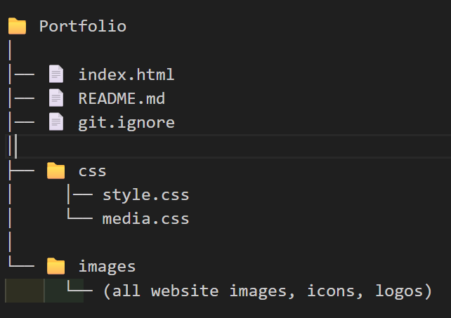

🌐 Bhagyashree Pawar — Developer Portfolio

Welcome to my personal portfolio website!
This project showcases my skills, projects, achievements, and my journey as a budding developer.
It is designed with a clean, modern, and aesthetic UI using HTML, CSS, and JavaScript.
The theme is a soft purple–pink–white combination to give a minimal and professional look.

✨ Features

🎨 Beautiful UI with Purple-Pink Theme

📱 Fully Responsive Design for mobile,Tablets

👩‍💻 About Me Section

🛠️ Skills Section with Clickable Technology Icons

📁 Projects Section with GitHub Links and screenshots

🏆 Achievements Section

📬 Contact Form / Social Links

🛠️ Tech Stack

HTML5

CSS3

JavaScript

Bootstrap (Optional — if you used it)

Responsive Layout Techniques

📂 Folder Structure

